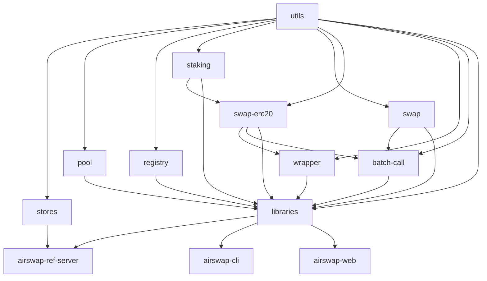

# AirSwap Protocols - Clearmatics fork

## NPM packages

### [Tools](./tools)

- [`@airswap/libraries`](./tools/libraries)
- [`@airswap/stores`](./tools/stores)
- [`@airswap/utils`](./tools/utils)

### [Contracts](./source)

- [`@airswap/batch-call`](./source/batch-call)
- [`@airswap/pool`](./source/pool)
- [`@airswap/registry`](./source/registry)
- [`@airswap/staking`](./source/staking)
- [`@airswap/swap`](./source/swap)
- [`@airswap/swap-erc20`](./source/swap-erc20)
- [`@airswap/wrapper`](./source/wrapper)

## Dependency graph

## How to add a new network

1. Install Node v18.19.0 and install dependencies with `yarn`
1. Download the genesis file of the network and find the USDC contract address
1. Generate token list with
   `scripts/generate-token-list <genesis-file> <usdc-token-address>` and commit
   into [`tokenlists`](./tokenlists)
1. Add configuration parameters to the following files:
    - [`tools/utils/src/constants.ts`](./tools/utils/src/constants.ts)
    - [`tools/utils/src/tokenlists.ts`](./tools/utils/src/tokenlists.ts)
    - [`hardhat.config.js`](./hardhat.config.js)
    - [`source/registry/scripts/config.js`](./source/registry/scripts/config.js)
    - [`source/swap/scripts/config.js`](./source/swap/scripts/config.js)
    - [`source/swap-erc20/scripts/config.js`](./source/swap-erc20/scripts/config.js)
    - [`source/wrapper/deploys-weth.js`](./source/wrapper/deploys-weth.js)
1. Bump version number in `tools/utils/package.json` and commit the changes
1. Rebuild `@tools/utils` with `yarn compile` and create a new package with `npm pack`
1. Create a new release on GitHub and upload `airswap-utils-xxx.tgz`
1. Update the `@airswap/utils` version in all `package.json` files and update
   dependencies with `yarn`
1. Get an account with a few ATNs for funding the deployments
1. Set the `PRIVATE_KEY` environment variable in `.env`
1. Deploy the mock AirSwap token from [`misc/ast`](./misc/ast) and the contracts
   from [`source`](./source) with `yarn deploy --network NAME` in the order
   specified in the dependency graph above
1. Bump version numbers in `package.json` of all affected packages and commit
   the updated `deploys.js` files
1. Update dependency versions in all `package.json` files
1. Create packages with `yarn dist`
1. Upload packages from the `dist` directory to the new release on GitHub
1. Update dependency versions in `package.json` in the following repositories:
    - [clearmatics/airswap-cli]
    - [clearmatics/airswap-ref-server]
    - [clearmatics/airswap-web]
1. Create a new [clearmatics/airswap-cli] release on GitHub according to its
   [documentation](https://github.com/clearmatics/airswap-cli/blob/autonity/CLEARMATICS.md)
1. Install airswap-cli from the new release with `npm i -g <package-URL>`
1. Set the `CHAIN_ID`, `PRIVATE_KEY` and `PROTOCOL_FEE` environment variables for
   [clearmatics/airswap-ref-server] and deploy the server
1. Set the `SERVER_URL` environment variable in `.env` and configure the registry
   contract with `scripts/configure-registry`
1. Check whether configuration was successful with `airswap registry:status`
1. Redeploy [clearmatics/airswap-web]

[clearmatics/airswap-cli]: https://github.com/clearmatics/airswap-cli
[clearmatics/airswap-ref-server]: https://github.com/clearmatics/airswap-ref-server
[clearmatics/airswap-web]: https://github.com/clearmatics/airswap-web
